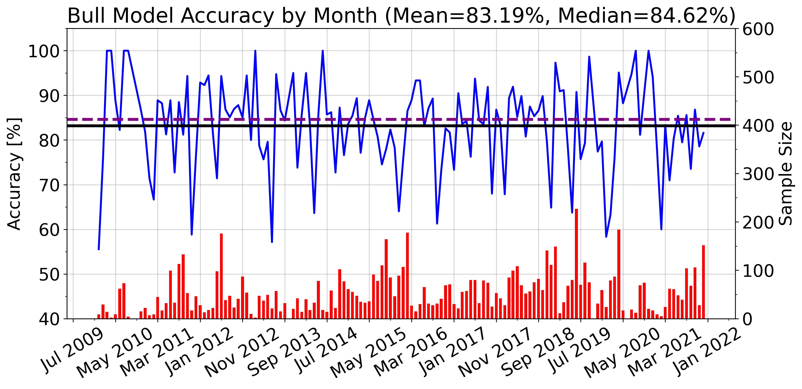

# The Pardun Stock Algorithm

You're probably wondering if this is worth your time, I get it so I'll lead off with this plot. Yeah, it's worth it.



## Overview
 This is an applied machine-learning algorithm to help make financial decisions for you to grow your portfolio on your terms. This is a pythonic machine learning application that predicts stock price movements for either buying shares or option contracts.
 
 ***DISCLAIMER: This is not financial advice of any kind. You must use what we call PSA at your own risk to make your own financial decisions. We are not responsible for financial losses or gains you may encounter. By running this code on your machine, you agree to these terms.***

This is a highly functioning, complex, and quite fun application that is used to predict stock prices for the day of trading of your choosing. Incorporated is a series of logistical regressions and support vector classifcation (SVC) algorithms that learn how stocks behave. Here is how this thing works. We essentially create an index from the MACD, RSI, and CCI oscillators that are tell tale signs of a large increase in the stock price. The same holds true for a large decrease given specific patterns of the MACD, RSI, and CCI. However, these signals are quite rare for any stock. We create this index, either 1 for bullish signals, -1 for bearish signals, or 0 for neither bullish nor bearish signals. The most common value in this time series for the stock in question is a 0. We then take the instances in which a 1 or -1 is shown and train logisitic regression and SVC algorithms to learn how the stock behaves when a 1 or -1 is present and these algorithms then produce a forecast for either a 0, 1, or -1 for the next day or trading. Stocks that are forecasted to have a 1 or -1 are then printed into the terminal where **psa_main.py** is run. To learn how this index is computed, look at the **predictors** function housed in **psa_main.py**.


The stock symbols that are run through the algorithm are located in **Symbols.csv**. Feel free to add, change, or modify the stock list as you see fit. There is no limit to how many stocks are added or subtracted to the CSV, as long as these stocks are found in the yfinance library, you are good to go. For reference, it usually takes 5 minutes to run ~1000 ticker symbols on a 16 GB RAM MacBook Pro. However, the more stocks that are added, the longer the program takes to run. By runnung **psa_main.py** on your machine, all stocks contained in the CSV file will be parsed through and a prediction will be made for each (unless otherwise stated, which will be explored in the following section). This model may work well with some stocks, but may perform poorly with others. Use caution when adding highly volatile stocks. 

## The Origin Story
Hi, my name is Tyler Pardun. I'm a Graduate Research Assistant working towards my Master's Degree in Meteorology at the University of Oklahoma. My interest in computer science didn't start until after I started diving into the research world of Meteorology. There's a lot of data to be looked at and a lot still to be understood. This passion project really helped develop some of my coding and analysis skills that I use on a daily basis. In my free time, I've been wondering if there are any good ways to analyze stock movements and how computers can help with that. This small passion project turned into a very big and useful thing that I'm still perfecting. Anyway, I hope that I can share some of my passion with you here.

Michael Pardun is not only my partner in crime, but he is also my identical twin brother. He graduated from Illinois State University back in 2021 with a major in Mathematics and an emphasis in statsitics. He is now working as an Operations Analyst and is an aspriring Sports Analyst for any major league team.


## The Setup
To set up the environment needed to run what we call PSA, first open up a terminal window and clone this repository and change directories into it

```
$ git clone https://github.com/TylerPardun/Pardun_Stock_Algorithm.git
$ cd Pardun_Stock_Algorithm/
```

Then, run the following to set up the Anaconda environment. It is best to make sure you have the most up-to-date version of anaconda so this will work eith ease. We named the environment ml for machine learning. You can change the name of the environment by simply putting the name after -n to whatever suits you best, we won't judge. Make sure to change the conda environment name when activating the environment too.

```
$ conda update conda
$ conda env create -f ml.yml -n your_name_here
$ conda activate your_name_here
```

If the environment set up is not working as it should, don't be alarmed. This seems to be a common occurence across other repositories and could very well just be the way each computer is wired up. If this is the case, create a new environment in Anaconda and download the packages needed until **psa_main.py** runs on your machine. Should be simple.

## Usage
After the environment is set up in Anaconda, you are able to run **psa_main.py**. There are two options you can choose from. If you are wanting predictions from your list of stocks set in **Symbols.csv** before trading begins on December 9th, 2022, you would want to run

```
$ python -m sklearnex psa_main.py 2022-12-09
```

The output that is printed onto the terminal window are stock symbols that are projected to either move up or down. If the stock is projected to neither move up or down significantly, there will be no printed output in this first example. The direction of movement is noted by the "BUY" or "SELL" at the beginning of the printed phrase.
  
If you are wanting to run the program for a specific stock only, say Tesla, on December 9th, 2022, you would want to run

```
$ python -m sklearnex psa_main.py 2022-12-09 TSLA
```

In this example, the projection will be printed whether it is forecasted to move up significantly (1), down significantly (-1), or neither up or down in a significant manner (0).

If you feel brave, you may also like to check out the Principle Component Analysis performed in the **PCA_analysis.ipynb** file. I will not go into detail about PCA computations, but here are some supplemental materials that go into detail about PCA analysis and how it's used:

Abdi, H. and Williams, L.J. (2010), Principal component analysis. WIREs Comp Stat, 2: 433-459. https://doi.org/10.1002/wics.101

Ringnér, M. What is principal component analysis?. Nat Biotechnol 26, 303–304 (2008). https://doi.org/10.1038/nbt0308-303


## Backtesting
We've done lots of backtesting on this model and accuracies are held between 60%-80% throughout the years. In the folder called **backtest_output/**, there is logged data of previously initalized dates and the predictions of stock symbols that were forecasted to move upwards in a significant manner. Price movements for the next 10 trading days after the date of initialization are recorded to see whether the stock symbol actually moved. From this, we can compute accuracies on a week-to-week, month-to-month or even a year-to-year basis. Feel free to conduct your own post-mortem analysis using this data. 

There are still things to perfect, bugs to catch, etc. If there are questions or anything related to improvements, or even any collabrative efforts, feel free to reach me at tyler.pardun@gmail.com
